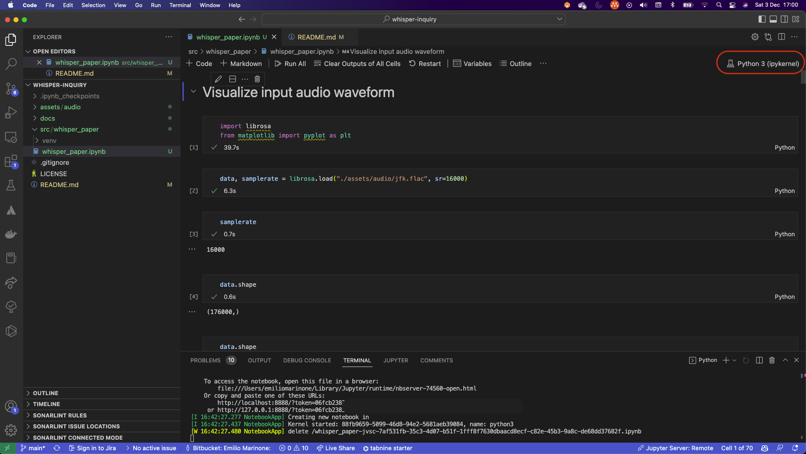
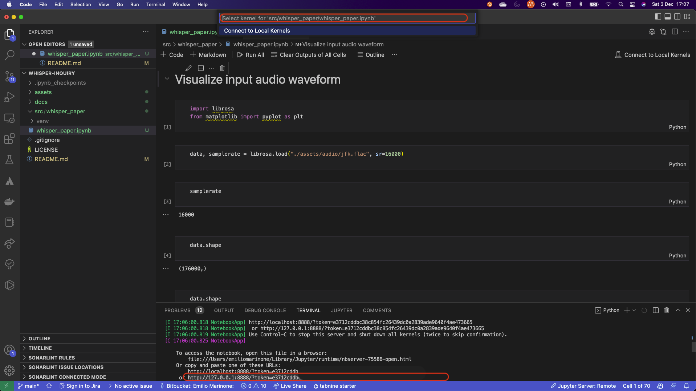

# Whisper inquiry
This repo hosts the code related to research and exploration activities related to [Whisper](https://cdn.openai.com/papers/whisper.pdf). Citing from [OpenAI's repo](https://github.com/openai/whisper):

"Whisper is a general-purpose speech recognition model. It is trained on a large dataset of diverse audio and is also a multi-task model that can perform multilingual speech recognition as well as speech translation and language identification."

<div class="img-div-any-width" markdown="0">
  
  <br />

</div>

## Repository name
The repository name was suggested by the new GPT3 model recently released by OpenAI: GPT3 `text-davinci-003`. I adjusted the temperature during the conversation, all the other parameters were the default ones.

[This](docs/repo_name.md) is the short conversation we had.

Just after my short conversation with `text-davinci-003`, its cousin [ChatGPT](https://openai.com/blog/chatgpt/) was released. We had a similar chat, and [here](docs/repo_name_chatgpt.md) you can see how it went.

Thanks, OpenAI. Five minutes and 0.02$ saved me from a big headache, and a good excuse to further procrastinating the publication of my first article.

## Whisper paper - an initial analysis
My inquiry journey started with a deep understanding of the paper, and resulted into an article which will be shared shortly and linked here.

This repo hosts the [notebook](src/whisper_paper/whisper_paper.ipynb) used to help me understanding the architecture and the paper, and generate some pltos.

### Instructions
Please note that the notebook is not designed to run sequentially end-to-end, although it might do it successfully, but rather to understand and visualize the different subcomponents of the architecture. Note that this has been developed on macOS Big Sur 11.5.2, and it might not work on other Operating Systems. Linux should be fine, but I have not tested it. I also use Python3.8.6, and I have not tested it with other versions.

To run the notebook, first create a clean virtual environment. Then, install the requirements:
```
python3 -m venv venv
source venv/bin/activate
pip install src/whisper_paper/requirements.txt
```

Then, start the your Jupyter notebook server:
```
python -m notebook
```

Finally, open the notebook and run the cells.

To run it on VS Code, you need to use the correct virtual environment. To do so, open the command palette (Ctrl+Shift+P) and select `Python: Select Interpreter`. Then, select the virtual environment you created. If you can't find it, you can attach it to the server by clicking on the virtual environment currently selected on the top-right corner of your notebook. 

<div class="img-div-any-width" markdown="0">
  
  <br />

</div>

Then, you can copy-paste your kernel URL (including the token) to the upper text area highlighted and press Enter.

<div class="img-div-any-width" markdown="0">
  
  <br />

</div>
